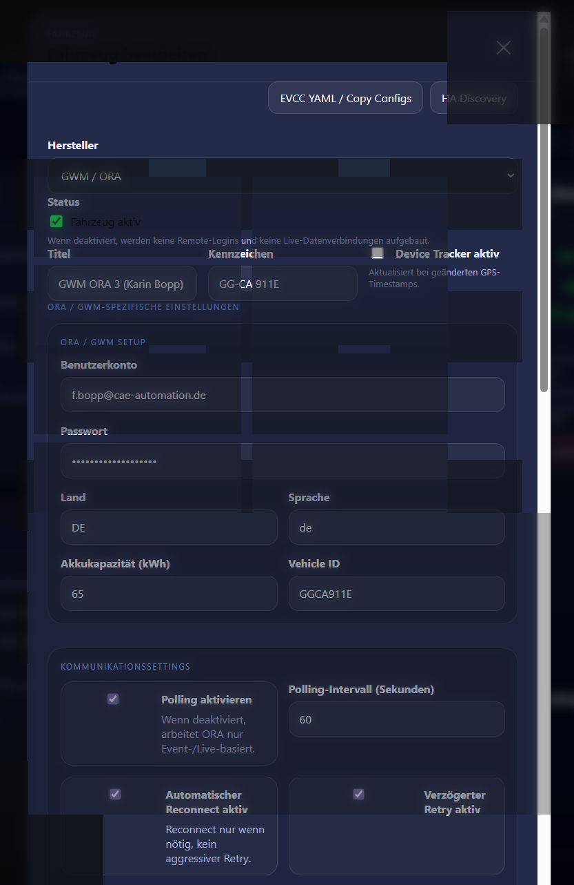

# Car2MQTT

**Car2MQTT** ist ein Home-Assistant-Add-on für Fahrzeugdaten über MQTT.  
Es bündelt mehrere Hersteller in einer Oberfläche, mappt Rohdaten auf ein einheitliches Schema, kann Daten an weitere MQTT-Broker weiterleiten und erzeugt pro Fahrzeug kopierbare Vorlagen für **EVCC**.

## Highlights

- Home-Assistant-Add-on mit Weboberfläche
- Fahrzeugdaten lokal nach MQTT schreiben
- Fahrzeugdaten an **externe / remote MQTT-Clients** weiterleiten
- **Remote-Fahrzeuge** aus MQTT automatisch erkennen und im Dashboard anzeigen
- Einheitliches `mapped`-Schema über Hersteller hinweg
- **Home Assistant MQTT Discovery** für Fahrzeug-Entitäten
- Optionaler **MQTT Device Tracker**
- **EVCC YAML / Copy Helper** pro Fahrzeug
- Copy-Helper für `configuration.yaml`, `automations.yaml` und fahrzeugspezifische Variablenblöcke
- Live-Logs sowie ReAuth-/Reconnect-Hilfen für unterstützte Hersteller

## Getesteter Stand

### Verifiziert und im Einsatz
- **BMW CarData (EU Data Act)** ✅
- **GWM / ORA** ✅

### Hinzugefügt, aber derzeit nicht vollständig getestet
- **ACCIONA / Generic** ⚠️
- Weitere Hersteller-/Topic-Strukturen, die als **Remote-Fahrzeug über MQTT** gespiegelt werden ⚠️

> Hinweis: BMW und GWM/ORA sind die aktuell praktisch getesteten Integrationen.  
> Weitere Hersteller sind vorbereitet bzw. als generische/remote Datenquelle nutzbar, aber noch nicht vollständig verifiziert.

## Integrationen

### Home Assistant
- Add-on mit eigener Weboberfläche
- Home Assistant MQTT Discovery
- optionaler Device Tracker
- Home Zone Auswahl für EVCC-Automationen

### MQTT
- lokaler MQTT-Broker als Hauptziel
- Weiterleitung an beliebig viele **zusätzliche MQTT-Clients**
- optional nur `mapped` oder zusätzlich `raw`
- Remote-Fahrzeuge werden aus MQTT wieder eingelesen und angezeigt

### EVCC
- pro Fahrzeug generierte **EVCC-Vorlage**
- per UI direkt kopierbar
- zusätzlich Copy-Helper für passende MQTT-Sensoren und Automationen

## Was Car2MQTT macht

Car2MQTT verarbeitet Fahrzeugdaten in mehreren Stufen:

1. **Herstellerdaten abrufen**  
   z. B. BMW CarData oder GWM/ORA

2. **Rohdaten nach MQTT schreiben**  
   unter dem jeweiligen Hersteller-/Fahrzeugpfad

3. **Daten auf ein gemeinsames Schema mappen**  
   z. B. SoC, Reichweite, Kilometerstand, Ladezustand, Tankinhalt, Fahrzeugtyp

4. **Daten optional an weitere MQTT-Server weiterleiten**

5. **Remote-Fahrzeuge aus MQTT zurück ins Dashboard einlesen**  
   So lassen sich Fahrzeuge auf mehreren Home-Assistant-Systemen sichtbar machen

6. **EVCC- und Home-Assistant-Helfer erzeugen**  
   per Copy-Button direkt aus der UI

## Unterstützte Fahrzeugdarstellung

Je nach erkanntem Fahrzeugtyp wird die Kachel unterschiedlich aufgebaut:

- **EV / Elektrofahrzeug**
  - SoC
  - Reichweite
  - Lädt
  - Angesteckt
  - Kilometer
  - Ladelimit

- **Hybrid**
  - SoC / E-Reichweite
  - Tankinhalt / Restreichweite
  - Lädt
  - Angesteckt
  - Kilometer
  - Ladelimit

- **Verbrenner**
  - Tankinhalt
  - Restreichweite
  - Kilometer
  - Antrieb

## Remote MQTT / verteilte Setups

Car2MQTT kann Fahrzeugdaten nicht nur lokal veröffentlichen, sondern auch an **weitere MQTT-Server** verteilen.

Dadurch sind folgende Szenarien möglich:

- ein zentraler Hauptserver liefert Fahrzeugdaten
- mehrere weitere Home-Assistant-Instanzen konsumieren diese Daten
- Remote-Fahrzeuge erscheinen dort automatisch im Dashboard
- lokale Fahrzeuge und Remote-Fahrzeuge können parallel angezeigt werden

Die Remote-Ansicht ist bewusst reduziert:
- Status und Fahrdaten sichtbar
- Kennzeichnung als **REMOTE**
- Bearbeiten-Dialog mit Informationsfeldern
- Copy-Configs weiterhin verfügbar

## EVCC Copy Helper

Zu jedem Fahrzeug wird eine direkt kopierbare Vorlage erzeugt, u. a. für:

- `evcc` Fahrzeug-Abschnitt
- `configuration.yaml`
- `automations.yaml`
- Variablenblöcke für Fahrzeugentscheidungen / Ladeautomationen

Dadurch lässt sich das Fahrzeug schneller in EVCC und Home Assistant einbinden, ohne die YAML-Blöcke manuell zusammensuchen zu müssen.

## Screenshots

> Die Beispielbilder unten wurden für die README **anonymisiert / unkenntlich gemacht**  
> (Kennzeichen, Namen, Hosts, Logins und ähnliche sensible Daten sind geschwärzt bzw. weichgezeichnet).

### UI-Beispiel 1


### UI-Beispiel 2


## MQTT-Struktur

Typisch sind folgende Topics:

```text
car/<manufacturer>/<plate>/_meta/...
car/<manufacturer>/<plate>/mapped/...
car/<manufacturer>/<plate>/...
```

Beispiele:
- `car/bmw/GGCA501E/mapped/soc`
- `car/gwm/GGCA911E/mapped/range`
- `car/bmw/GGCA1056/_meta/last_update`

## Wichtige Funktionen in der Oberfläche

### Fahrzeuge
- lokale Fahrzeuge anlegen
- Hersteller auswählen
- Zugangsdaten / fahrzeugspezifische Parameter pflegen
- MQTT-Clients je Fahrzeug zuweisen
- Device Tracker je Fahrzeug aktivieren

### Einstellungen
- Home Zone für EVCC-/Automations-Helfer
- MQTT Discovery aktivieren
- Entitäten automatisch erzeugen
- Device Tracker global aktivieren
- Discovery manuell erneut senden

### MQTT Clients
- zusätzliche MQTT-Zielserver definieren
- Client aktiv / inaktiv
- `raw` mit übertragen oder nur `mapped`
- Online-Status des Zielclients prüfen

### Copy Helper
- fertige Textbausteine direkt aus der UI kopieren
- für Home Assistant und EVCC

## Herstellerstatus im Überblick

| Hersteller / Quelle | Typ | Status |
|---|---|---|
| BMW CarData (EU Data Act) | native Integration | getestet |
| GWM / ORA | native Integration | getestet |
| ACCIONA / Generic | generisch / Platzhalter | hinzugefügt, nicht vollständig getestet |
| Remote MQTT Fahrzeuge | generisch aus MQTT | funktioniert für Anzeige/Weitergabe, je Quelle abhängig |

## Sicherheit / Datenschutz

Bitte beachte vor dem Veröffentlichen von Screenshots oder Logs:

- Kennzeichen unkenntlich machen
- Namen / Benutzernamen unkenntlich machen
- Hostnamen und Domains prüfen
- Logins, Tokens und Passwörter niemals veröffentlichen
- VIN nur veröffentlichen, wenn ausdrücklich gewünscht

## Hinweis zum Projektstatus

Car2MQTT ist stark auf praktische Home-Assistant-/MQTT-/EVCC-Workflows ausgerichtet.  
Der Fokus liegt auf:
- robuster Fahrzeuganzeige
- MQTT-Verteilung lokal und remote
- EVCC-Unterstützung
- einfacher Bedienung direkt in Home Assistant

BMW und GWM/ORA sind derzeit die am besten verifizierten Integrationen.  
Weitere Hersteller können ergänzt werden, ohne die bestehende Struktur zu entfernen.

## Lizenz / Nutzung

Ergänze hier bei Bedarf deine gewünschte Lizenz, z. B.:

```text
MIT License
```

oder eine projektspezifische Lizenz.

---

Wenn du willst, kannst du im nächsten Schritt noch
- ein Logo,
- Installationsschritte,
- einen Abschnitt **„Repository einbinden“**,
- oder eine **englische README**
ergänzen.
