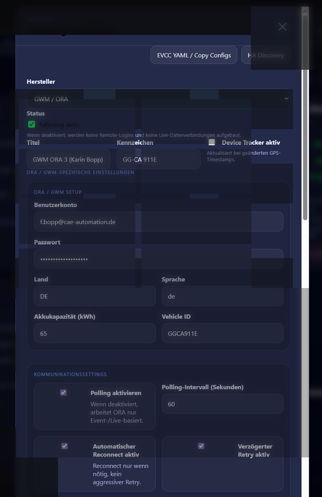

# Car2MQTT

**Car2MQTT** ist ein Home-Assistant-Add-on für Fahrzeugdaten über MQTT.  
Es bündelt mehrere Hersteller in einer Oberfläche, mappt Rohdaten auf ein einheitliches Schema, kann Daten an weitere MQTT-Broker weiterleiten und erzeugt pro Fahrzeug kopierbare Vorlagen für **EVCC**.

## Highlights

- Home-Assistant-Add-on mit Weboberfläche
- Fahrzeugdaten lokal nach MQTT schreiben
- Fahrzeugdaten an **externe / remote MQTT-Clients** weiterleiten
- **Remote-Fahrzeuge** aus MQTT automatisch erkennen und im Dashboard anzeigen
- Einheitliches `mapped`-Schema über Hersteller hinweg
- **Home Assistant MQTT Discovery** für Fahrzeug-Entitäten
- Optionaler **MQTT Device Tracker**
- **EVCC YAML / Copy Helper** pro Fahrzeug
- **EVCC Geo Detection**: lokaler A/B/C-Status aus Fahrzeugverbindung + GPS + Home-Assistant-Zone
- Copy-Helper für `configuration.yaml`, `automations.yaml` und fahrzeugspezifische Variablenblöcke
- Live-Logs sowie ReAuth-/Reconnect-Hilfen für unterstützte Hersteller

## Getesteter Stand

### Verifiziert und im Einsatz
- **BMW CarData (EU Data Act)** ✅
- **GWM / ORA** ✅
- **ACCIONA / Silence über MySilence** ✅

### Weitere unterstützte Strukturen
- Weitere Hersteller-/Topic-Strukturen, die als **Remote-Fahrzeug über MQTT** gespiegelt werden ⚠️

> Hinweis: BMW, GWM/ORA und ACCIONA/Silence (MySilence) sind praktisch mit produktiven Konten getestet.  
> Die MySilence-Anbindung ist vollständig in UI, Worker und Mapping integriert und liefert unter anderem SoC, Reichweite und GPS-Daten.

## Integrationen

### Home Assistant
- Add-on mit eigener Weboberfläche
- Home Assistant MQTT Discovery
- optionaler Device Tracker
- Home Zone Auswahl für EVCC-Automationen

### ACCIONA / Silence (MySilence)
- read-only Cloud-Abfrage mit den Zugangsdaten der MySilence App
- GPS-Position als `latitude`, `longitude` und optional `altitude`
- Ladezustand als `soc`
- Restreichweite als `range`
- optional feste Fahrzeugauswahl über FrameNo, IMEI oder Name
- konfigurierbares Polling, standardmäßig alle 60 Sekunden

Die MySilence-Schnittstelle ist nicht offiziell dokumentiert und kann sich durch App-/Backend-Änderungen ändern.

### MQTT
- lokaler MQTT-Broker als Hauptziel
- Weiterleitung an beliebig viele **zusätzliche MQTT-Clients**
- optional nur `mapped` oder zusätzlich `raw`
- Remote-Fahrzeuge werden aus MQTT wieder eingelesen und angezeigt

### EVCC
- pro Fahrzeug generierte **EVCC-Vorlage**
- per UI direkt kopierbar
- standortabhängiger `evccStatus` (`A`/`B`/`C`) direkt über MQTT
- optionaler Geo-Filter gegen die lokal ausgewählte Home-Assistant-Zone
- zusätzlich Copy-Helper für passende MQTT-Sensoren und Automationen

## Was Car2MQTT macht

Car2MQTT verarbeitet Fahrzeugdaten in mehreren Stufen:

1. **Herstellerdaten abrufen**  
   z. B. BMW CarData oder GWM/ORA

2. **Rohdaten nach MQTT schreiben**  
   unter dem jeweiligen Hersteller-/Fahrzeugpfad

3. **Daten auf ein gemeinsames Schema mappen**  
   z. B. SoC, Reichweite, Kilometerstand, Ladezustand, Tankinhalt, Fahrzeugtyp

4. **Daten optional an weitere MQTT-Server weiterleiten**

5. **Remote-Fahrzeuge aus MQTT zurück ins Dashboard einlesen**  
   So lassen sich Fahrzeuge auf mehreren Home-Assistant-Systemen sichtbar machen

6. **EVCC- und Home-Assistant-Helfer erzeugen**  
   per Copy-Button direkt aus der UI

## Unterstützte Fahrzeugdarstellung

Je nach erkanntem Fahrzeugtyp wird die Kachel unterschiedlich aufgebaut:

- **EV / Elektrofahrzeug**
  - SoC
  - Reichweite
  - Lädt
  - Angesteckt
  - Kilometer
  - Ladelimit

- **Hybrid**
  - SoC / E-Reichweite
  - Tankinhalt / Restreichweite
  - Lädt
  - Angesteckt
  - Kilometer
  - Ladelimit

- **Verbrenner**
  - Tankinhalt
  - Restreichweite
  - Kilometer
  - Antrieb

## Remote MQTT / verteilte Setups

Car2MQTT kann Fahrzeugdaten nicht nur lokal veröffentlichen, sondern auch an **weitere MQTT-Server** verteilen.

Dadurch sind folgende Szenarien möglich:

- ein zentraler Hauptserver liefert Fahrzeugdaten
- mehrere weitere Home-Assistant-Instanzen konsumieren diese Daten
- Remote-Fahrzeuge erscheinen dort automatisch im Dashboard
- lokale Fahrzeuge und Remote-Fahrzeuge können parallel angezeigt werden

Die Remote-Ansicht ist bewusst reduziert:
- Status und Fahrdaten sichtbar
- Kennzeichnung als **REMOTE**
- Bearbeiten-Dialog mit Informationsfeldern
- Copy-Configs weiterhin verfügbar

## Home Assistant MQTT Discovery

Car2MQTT kann die Home-Assistant-Entitäten für lokale Fahrzeuge direkt über MQTT Discovery bereitstellen. Nach einmaliger Aktivierung unter **Einstellungen → Home Assistant → MQTT Discovery** werden die Entitäten beim Start sowie beim Anlegen oder Ändern eines Fahrzeugs automatisch veröffentlicht.

Für die Migration aus einer bestehenden manuellen `configuration.yaml` ist die Discovery-Funktion bei Upgrades zunächst deaktiviert. Entferne zuerst die bisherigen vier Car2MQTT-Fahrzeugsensoren (`plugged`, `plugged_ts`, `latitude`, `longitude`) aus der manuellen MQTT-Sensor-Konfiguration und aktiviere anschließend Discovery. Die automatisch erzeugten Sensoren behalten absichtlich die bisherigen Entity-IDs wie `sensor.car_bmw_<kennzeichen>_plugged`, sodass die vorhandenen Fahrzeugerkennungs-Automationen nicht angepasst werden müssen.

Zusätzlich werden – soweit der jeweilige Hersteller den Wert liefert – unter anderem SoC, Reichweite, Kilometerstand, Ladelimit, Akkukapazität, Ladezustand und weitere Fahrzeugzustände als Entitäten angelegt. Nicht vorhandene Herstellerwerte bleiben in Home Assistant einfach unbekannt. Der separat konfigurierbare Device Tracker bleibt davon unabhängig.

## Silence / ACCIONA EVCC-Hinweis (ab 1.2.55)

Für MySilence-Fahrzeuge verwendet die erzeugte EVCC-Konfiguration standardmäßig `phases: 1` und lässt `limitsoc` weg, weil MySilence derzeit keinen entsprechenden Fahrzeug-Limitwert liefert. Der EVCC-Status wird wie bei den anderen Fahrzeugen ausschließlich aus dem lokal erzeugten `mapped/evccStatus` gelesen.

Beim MySilence-Mapping hat ein expliziter Anschlusswert (`plugged`, `connected`, `chargerConnected` oder `chargingConnected`) Vorrang vor dem Ladeflag. Nur wenn kein separater Anschlusswert vorhanden ist, dient `charging` als Fallback für `plugged`. Dadurch kann `charging=false` ein vorhandenes `connected=true` nicht mehr überschreiben.

## EVCC Geo Detection

Ab Version 1.2.54 erzeugt jede Car2MQTT-Installation auf ihrem **lokalen MQTT-Broker** einen zusätzlichen EVCC-Status pro Fahrzeug:

```text
car/<manufacturer>/<plate>/mapped/evccStatus
car/<manufacturer>/<plate>/mapped/evccAtSite
car/<manufacturer>/<plate>/mapped/evccDistance
car/<manufacturer>/<plate>/mapped/evccGeoReason
```

`evccStatus` verwendet die EVCC-Fahrzeugzustände `A` (nicht verbunden), `B` (verbunden) und `C` (lädt). Ist der Geo-Filter deaktiviert, wird der bisherige Zustand aus `plugged` und `charging` gespiegelt. Ist er aktiviert, werden `B` und `C` nur ausgegeben, wenn die aktuelle Fahrzeugposition innerhalb des konfigurierten Radius um die ausgewählte Home-Assistant-Zone liegt. Fehlen Zone oder GPS-Daten, fällt die Entscheidung absichtlich auf `A` zurück.

Der Filter verändert **nicht** die Herstellerwerte `mapped/plugged` oder `mapped/charging`. Dadurch bleiben Home Assistant, Diagnose und andere MQTT-Verbraucher unverfälscht. Weil die Berechnung lokal aus den auf dem Broker vorhandenen `mapped`-Topics erfolgt, funktioniert sie auch mit Remote-Fahrzeugen: derselbe Wagen kann an Standort A `A` und an Standort B gleichzeitig `B` oder `C` liefern. Der abgeleitete Status wird nicht über die Car2MQTT-MQTT-Weiterleitung an andere Standorte gespiegelt.

Aktivierung: **Einstellungen → EVCC → Standortabhängige Fahrzeugerkennung**. Dort wird auch der Radius in Metern festgelegt; als Mittelpunkt dient die oben ausgewählte Home Zone. Die EVCC-Copy-Vorlage liest anschließend direkt `mapped/evccStatus`.

## EVCC Copy Helper

Zu jedem Fahrzeug wird eine direkt kopierbare Vorlage erzeugt, u. a. für:

- `evcc` Fahrzeug-Abschnitt
- `configuration.yaml`
- `automations.yaml`
- Variablenblöcke für Fahrzeugentscheidungen / Ladeautomationen

Dadurch lässt sich das Fahrzeug schneller in EVCC und Home Assistant einbinden, ohne die YAML-Blöcke manuell zusammensuchen zu müssen.

## Screenshots

> Die Beispielbilder unten wurden für die README **anonymisiert / unkenntlich gemacht**  
> (Kennzeichen, Namen, Hosts, Logins und ähnliche sensible Daten sind geschwärzt bzw. weichgezeichnet).

### UI-Beispiel 1


### UI-Beispiel 2


## MQTT-Struktur

Typisch sind folgende Topics:

```text
car/<manufacturer>/<plate>/_meta/...
car/<manufacturer>/<plate>/mapped/...
car/<manufacturer>/<plate>/...
```

Beispiele:
- `car/bmw/GGCA501E/mapped/soc`
- `car/gwm/GGCA911E/mapped/range`
- `car/acconia/SIL123/mapped/soc`
- `car/acconia/SIL123/mapped/latitude`
- `car/acconia/SIL123/mapped/longitude`
- `car/bmw/GGCA1056/_meta/last_update`

## Wichtige Funktionen in der Oberfläche

### Fahrzeuge
- lokale Fahrzeuge anlegen
- Hersteller auswählen
- Zugangsdaten / fahrzeugspezifische Parameter pflegen
- MQTT-Clients je Fahrzeug zuweisen
- Device Tracker je Fahrzeug aktivieren

### Einstellungen
- Home Zone für EVCC-/Automations-Helfer und EVCC Geo Detection
- MQTT Discovery für Fahrzeug-Entitäten aktivieren
- Entitäten bei Start / Fahrzeugänderung automatisch erzeugen
- Discovery Prefix und Retain konfigurieren
- Device Tracker global aktivieren
- Discovery manuell erneut senden

### MQTT Clients
- zusätzliche MQTT-Zielserver definieren
- Client aktiv / inaktiv
- `raw` mit übertragen oder nur `mapped`
- Online-Status des Zielclients prüfen

### Copy Helper
- fertige Textbausteine direkt aus der UI kopieren
- für Home Assistant und EVCC

## Herstellerstatus im Überblick

| Hersteller / Quelle | Typ | Status |
|---|---|---|
| BMW CarData (EU Data Act) | native Integration | getestet |
| GWM / ORA | native Integration | getestet |
| ACCIONA / Silence (MySilence) | native Cloud-Polling-Integration | integriert, Praxistest mit echtem Konto ausstehend |
| Remote MQTT Fahrzeuge | generisch aus MQTT | funktioniert für Anzeige/Weitergabe, je Quelle abhängig |

## Sicherheit / Datenschutz

Bitte beachte vor dem Veröffentlichen von Screenshots oder Logs:

- Kennzeichen unkenntlich machen
- Namen / Benutzernamen unkenntlich machen
- Hostnamen und Domains prüfen
- Logins, Tokens und Passwörter niemals veröffentlichen
- VIN nur veröffentlichen, wenn ausdrücklich gewünscht

## Hinweis zum Projektstatus

Car2MQTT ist stark auf praktische Home-Assistant-/MQTT-/EVCC-Workflows ausgerichtet.  
Der Fokus liegt auf:
- robuster Fahrzeuganzeige
- MQTT-Verteilung lokal und remote
- EVCC-Unterstützung
- einfacher Bedienung direkt in Home Assistant

BMW und GWM/ORA sind derzeit die am besten verifizierten Integrationen.  
ACCIONA/Silence ist ab Version 1.2.32 als MySilence-Integration für GPS, SoC und Restreichweite enthalten.

## Lizenz / Nutzung

Ergänze hier bei Bedarf deine gewünschte Lizenz, z. B.:

```text
MIT License
```

oder eine projektspezifische Lizenz.

## EVCC Ladelimit ohne künstliche Veralterung (ab 1.2.56)

Das gemappte `limitSoc` ist ein langlebiger Fahrzeug-Einstellwert und kann unverändert bleiben, obwohl die Fahrzeugdatenverbindung vollkommen in Ordnung ist. Die von Car2MQTT erzeugte EVCC-Konfiguration setzt deshalb für `limitsoc` **keinen MQTT-`timeout` mehr**. EVCC akzeptiert den zuletzt empfangenen (retained) Wert damit so lange, bis Car2MQTT tatsächlich einen neuen Ladelimitwert veröffentlicht.

Live-Werte wie SoC, Reichweite, Kilometerstand und `evccStatus` behalten weiterhin einen Timeout, damit eine ausgefallene Datenquelle dort sichtbar wird. Ab Version 1.2.57 beträgt der Standard **72h (3 Tage)**. Damit bleiben Fahrzeuge, die ein bis zwei Tage nicht bewegt oder aktualisiert werden, in EVCC gültig, ohne die Fehlererkennung vollständig abzuschalten. Ein periodisches künstliches Neu-Publizieren des Ladelimits ist dadurch nicht nötig und würde eine ausgefallene Datenquelle eher verschleiern.


## EVCC Telemetrie-Timeout 72h (ab 1.2.57)

Die automatisch erzeugte EVCC-Fahrzeugkonfiguration verwendet für `soc`, `range`, `odometer` und `evccStatus` standardmäßig `timeout: 72h`. `limitsoc` bleibt weiterhin ohne Timeout, da das Ladelimit ein langlebiger Einstellwert ist. Ein fahrzeugspezifisch gesetztes `evcc_timeout` kann den 72h-Standard weiterhin überschreiben.
